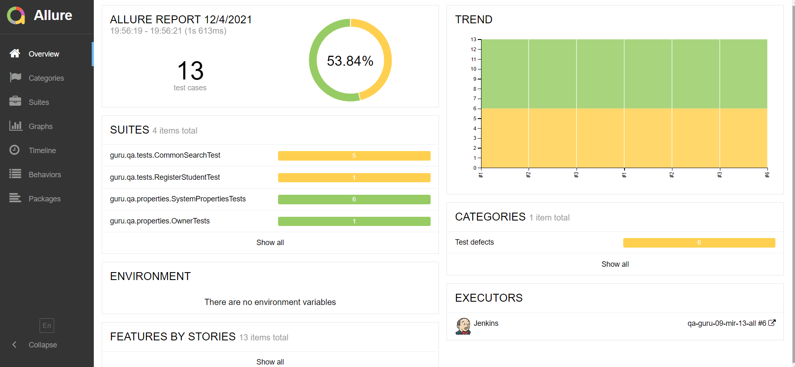
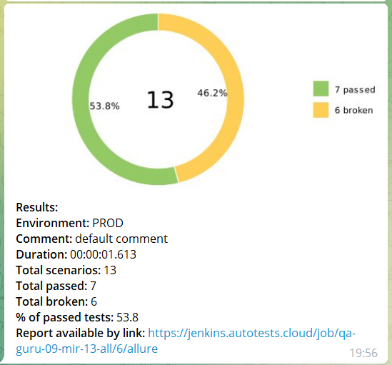

## :boom: Тестирование Wildberries

- Поиск товаров
- Открытие разделов

## :boom: Инструменты

</code>
<code></code>
<code></code>
<code></code>
<code></code>
<code></code>
<code></code>
<code></code>
<code></code>
<code></code>

- Автотесты написаны на <code><strong>*Java*</strong></code> с использованием фреймворка <code><strong>*Selenide*</strong></code> для UI-тестов.
- Для сборки проекта используется <code><strong>*Gradle*</strong></code>.
- <code><strong>*JUnit 5*</strong></code> используется как фреймворк для модульного тестирования.
- Запуск тестов выполняется из <code><strong>*Jenkins*</strong></code>.
- <code><strong>*Selenoid*</strong></code> используется для запуска браузеров в контейнерах  <code><strong>*Docker*</strong></code>.
- <code><strong>*Allure Report, Telegram Bot*</strong></code> используются для визуализации результатов тестирования.

## :boom: Запуск тестов в [Jenkins](https://jenkins.autotests.cloud/job/qa-guru-09-mir-13-all/6/)

## :boom: Отчет о результатах тестирования в [Allure Report](https://jenkins.autotests.cloud/job/qa-guru-09-mir-13-all/6/allure/)

  

## :boom: Уведомления в Telegram

  

